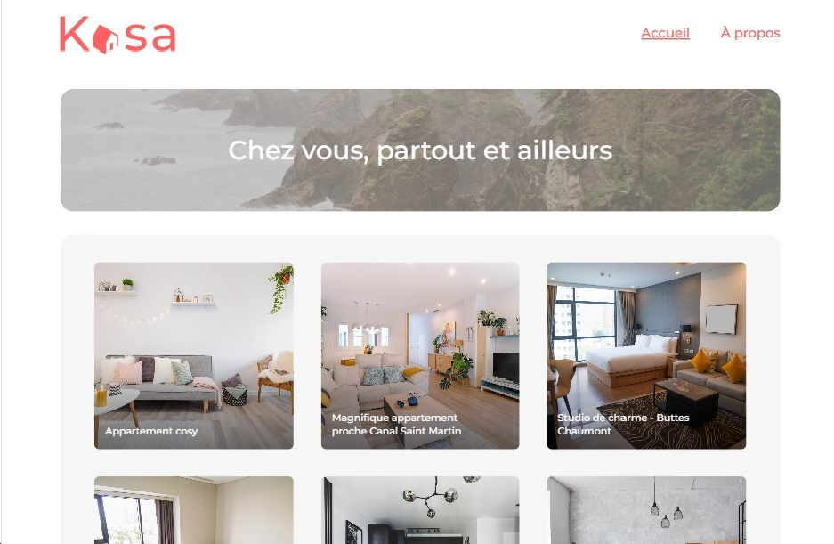

# Formation Développeur Web

## PROJET 7 : KASA - AGENCE DE LOCATION IMMOBILIERE



### Technologies :

- React
- Sass

### Installation :

Installer les dépendances avec la commande `npm install`

Démarrer le serveur avec la commande `npm start`

### Tester le projet :

```terminal
git clone https://github.com/LEF202209/KASA.git
```

